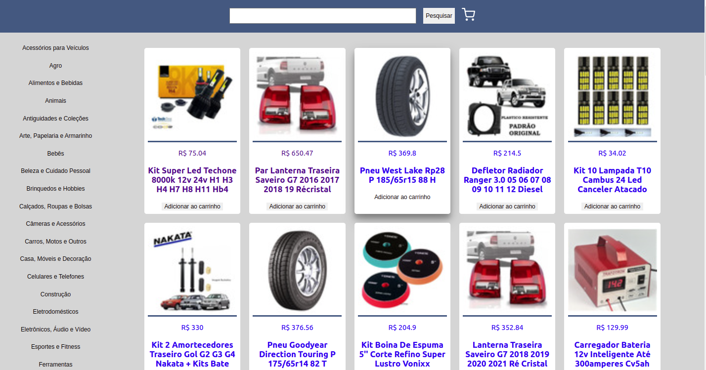

# Projeto Front-ens Online Store
 
# Contexto
 
Este projeto é uma uma versão simplificada, sem persistência no banco de dados, de uma loja online, desenvolvendo em grupo suas funcionalidades de acordo com demandas definidas em um quadro Kanban, em um cenário próximo ao do mercado de trabalho.
 
A partir dessas demandas, a aplicação terá as seguintes funcionalidades:
 
* Buscar produtos por termos e categorias a partir da API do Mercado Livre;
* Interagir com os produtos buscados de modo a adicioná-los e removê-los de um carrinho de compras em diferentes quantidades;
* Visualizar detalhes e avaliações prévias de um produto, bem como criar novas avaliações e;
* Simular a finalização da compra dos itens selecionados.


O projeto foi realizado em grupo.

### Davi Azevedo
linkedin: https://www.linkedin.com/in/daviazev/

GitHub: https://github.com/daviazev

### Heitor Soares 
linkedin: https://www.linkedin.com/in/heitorsoaresf/

GitHub: https://github.com/heitorsfernandes

### Hugo de Sousa Silva
linkedin: https://www.linkedin.com/in/hugo-de-sousa-dev/

### Thiago Seraphini 
linkedin: https://www.linkedin.com/in/thiago-seraphini-479a189b/

GitHub: https://github.com/ThiagoSeraphini


#



[Acesse o site aqui.](https://hugodesousa.github.io/frontend-online-store/#/)

## Tecnologias usadas

Front-end:
> Desenvolvido com HTML, CSS e JavaScript.
> React
 
#
## Executando aplicação
 
* Para o site direto no navegador:
 
 ```
  https://hugodesousa.github.io/frontend-online-store/#/
 ```
* Para rodar em uma máquina local
 
 ```
   No terminal rodar os comandos:
 ```
 ```
   git clone git@github.com:Hugodesousa/frontend-online-store.git
 ```
 ```
   cd frontend-online-store

 ```
 ```
   npm install
 ```
 ```
   npm start
 ```
#
### Projeto base fornecido pela Trybe
https://www.betrybe.com/
